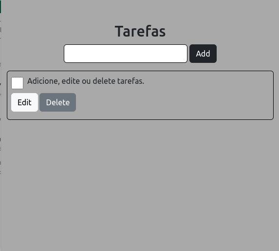
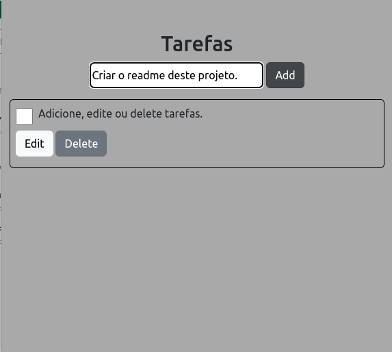
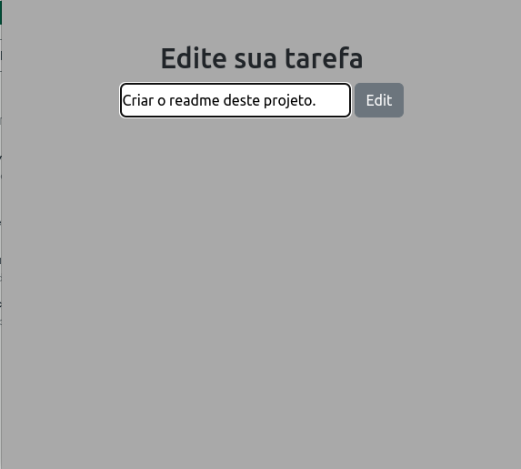
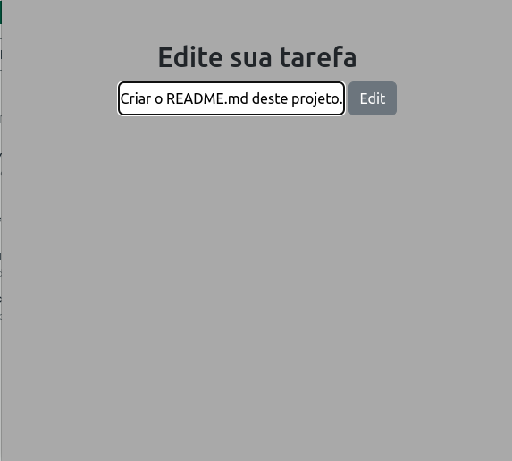
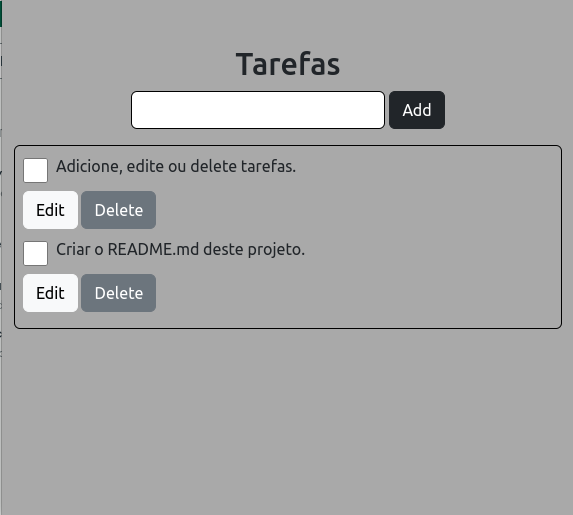
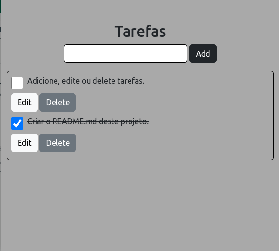
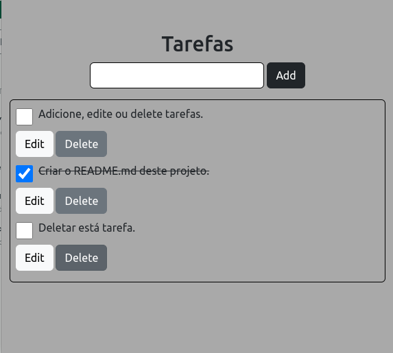

# todo-v2
Colocando conhecimento em prática.

Este projeto é uma evolução do [toDoList](https://github.com/DevVitorSilva/toDoList), neste, você não precisa se preocupar que suas tarefas irão desaparecer quando você recarregar a página ou fechar a aba do navegador. 

Este, assim como o [toDoList](https://github.com/DevVitorSilva/toDoList), foi feito para que eu podesse usar as tecnologias que aprendi, como para ir me familiarizando com o processo de desenvolvimento de aplicações.

Como ultilizar:

1° Esta será a tela inicial da aplicação.

2° Para adicionar uma tarefa basta digitar no campo de input, em seguida clicar no botão **Add**.

3° A página irá atualizar e a tarefa que você adicionou aparecerá junto as outras.

4° Para atualizar uma tarefa basta clicar no botão **Edit**, você será redirecionado para uma página com a tarefa que deseja editar.

5° Agora edite sua tarefa e clique no botão **Edit**, após isso você será direcionado para a página que contem todas as suas tarefas.

6° Você verá que sua tarefa foi editada com sucesso.

7° Para concluir uma tarefa basta clicar no chebox, o texto aparecerá riscado como concluido.

8° Para deletar uma tarefa basta clicar no botão **Delete**, a página será recarregada sem a tarefa deletada.

-------------------------------------------

